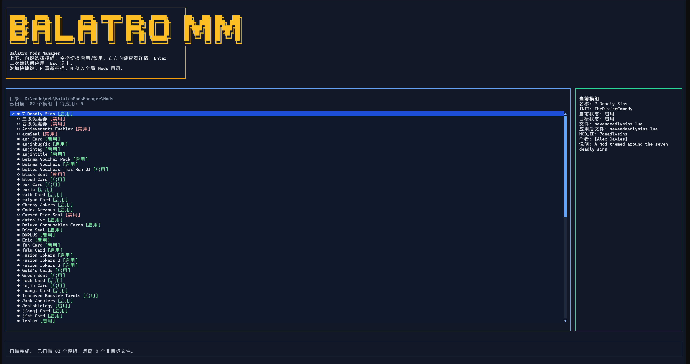

# Balatro Mods Manager

一个基于 Bun + TypeScript + OpenTUI 编写的 Balatro 模组管理器 TUI 应用。

它会扫描指定的 `Mods` 根目录，识别定义了 `SMODS.INIT.*` 的 `.lua` / `.lua.disable` 文件，把它们视为可管理的模组，并通过终端界面批量启用或禁用。

## 项目特性

- 只扫描 `Mods` 根目录，不进入任何子目录
- 识别 `.lua` 与 `.lua.disable` 两种状态文件
- 通过 Lua AST 解析 `SMODS.INIT.*`，避免仅靠字符串误判
- 解析模组文件顶部注释，提取 `MOD_NAME`、`MOD_ID`、`MOD_AUTHOR`、`MOD_DESCRIPTION`
- 提供 TUI 界面进行上下选择、空格切换、详情查看、确认应用
- 首次启动自动创建全局配置目录并保存 `Mods` 路径
- 支持 `--debug` 参数输出调试日志
- 支持使用 Bun 编译为 Windows 单文件 `exe`

## 项目截图



## 运行环境

- Bun `>= 1.3`
- Windows 终端环境

> 当前项目主要面向 Windows 使用场景开发和验证。

## 安装依赖

```bash
bun install
```

## 启动方式

开发模式运行：

```bash
bun run dev
```

直接运行入口：

```bash
bun run src/index.tsx
```

启用调试模式：

```bash
bun run src/index.tsx --debug
```

启用 `--debug` 后，程序会在项目根目录写入 `debug.log`。

## 使用说明

首次启动时：

1. 如果没有配置全局 `Mods` 目录，程序会要求你输入路径
2. 配置会写入 `%USERPROFILE%/.config/BalatroMM/config.json`
3. 保存后自动扫描根目录下的模组文件

主界面快捷键：

- `Up` / `Down`：上下选择模组
- `Space`：切换启用 / 禁用
- `Right`：查看当前模组详情
- `Esc`：退出详情或退出程序
- `Enter`：进入确认界面，再次 `Enter` 应用变更
- `R`：重新扫描当前 `Mods` 目录
- `M`：修改全局 `Mods` 目录

## 模组识别规则

程序只会把以下文件纳入扫描范围：

- 位于 `Mods` 根目录
- 文件后缀是 `.lua` 或 `.lua.disable`
- Lua AST 中存在 `SMODS.INIT.*` 定义

例如：

```lua
function SMODS.INIT.AchievementsEnabler()
    sendDebugMessage("AchievementsEnabler Activated!")
    G.F_NO_ACHIEVEMENTS = false
end
```

如果文件符合规则：

- `.lua` 视为已启用
- `.lua.disable` 视为已禁用

应用状态时：

- 禁用模组：`xxx.lua` -> `xxx.lua.disable`
- 启用模组：`xxx.lua.disable` -> `xxx.lua`

## 顶部注释解析

程序会读取 Lua 文件顶部连续注释，用于展示模组说明。

例如：

```lua
--- STEAMODDED HEADER
--- MOD_NAME: Achievements Enabler
--- MOD_ID: AchievementsEnabler
--- MOD_AUTHOR: [Steamo]
--- MOD_DESCRIPTION: Mod to activate Achievements
```

已支持提取：

- `MOD_NAME`
- `MOD_ID`
- `MOD_AUTHOR`
- `MOD_DESCRIPTION`
- `DISPLAY_NAME`

## 全局配置位置

配置目录：

```text
%USERPROFILE%/.config/BalatroMM
```

配置文件：

```text
%USERPROFILE%/.config/BalatroMM/config.json
```

当前保存内容主要包括：

- `modsDir`

## 常用命令

开发运行：

```bash
bun run dev
```

类型检查：

```bash
bun run typecheck
```

运行测试：

```bash
bun test
```

编译单文件 exe：

```bash
bun run build:exe
```

输出文件默认位于：

```text
dist/BalatroMM.exe
```

## 项目结构

```text
src/
  config.ts      # 全局配置读写
  index.tsx      # 程序入口
  mods.ts        # Mods 扫描、Lua AST 解析、状态应用
  mods.test.ts   # 扫描与改名测试
  types.ts       # 类型定义
  ui.tsx         # OpenTUI 界面与交互
demo.png         # 项目截图
README.md
CONTRIBUTING.md
```

## 开发说明

- TUI 基于 `@opentui/react`
- Lua 解析基于 `luaparse`
- 测试使用 Bun 自带测试框架

提交代码前建议执行：

```bash
bun run typecheck
bun test
```

## 贡献

欢迎提交 Issue 和 Pull Request。

贡献说明请查看：

- [CONTRIBUTING.md](./CONTRIBUTING.md)
